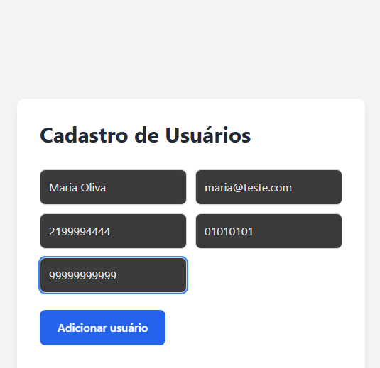
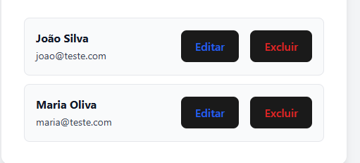

# 📋 Projeto Usuários — Cadastro Completo

Projeto full stack para cadastro e gerenciamento de usuários, desenvolvido com foco em boas práticas, validações e integração frontend + backend.

---

## 🚀 Funcionalidades

- ✅ Cadastro de usuários
- ✅ Validação de CPF (não permite duplicados)
- ✅ Busca automática de endereço pelo CEP
- ✅ Listagem de usuários
- ✅ Integração Frontend e Backend
- ✅ Persistência em banco de dados

---

## 🖥️ Tecnologias Utilizadas

### Frontend

- React
- TypeScript
- Vite
- Axios

### Backend

- Node.js
- TypeScript
- Express
- Prisma ORM

### Banco de Dados

- PostgreSQL (via Docker)

---

## 📸 Screenshots

### Cadastro de Usuários



---
### Lista de Usuários



## ⚙️ Como rodar o projeto

### 1️⃣ Clonar o repositório

```bash
git clone https://github.com/MoiRaibolt/projeto-usuarios.git
```

2️⃣ Subir banco de dados
docker compose up -d

3️⃣ Backend
cd backend
npm install
npm run dev

4️⃣ Frontend
cd frontend
npm install
npm run dev

📌 Observações

Este projeto foi desenvolvido com foco em aprendizado prático, organização de código e simulação de um sistema real utilizado no mercado.

👤 Autor

Moisés Raibolt
📚 Estudante de Análise e Desenvolvimento de Sistemas
🚀 Em constante evolução na área de tecnologia
